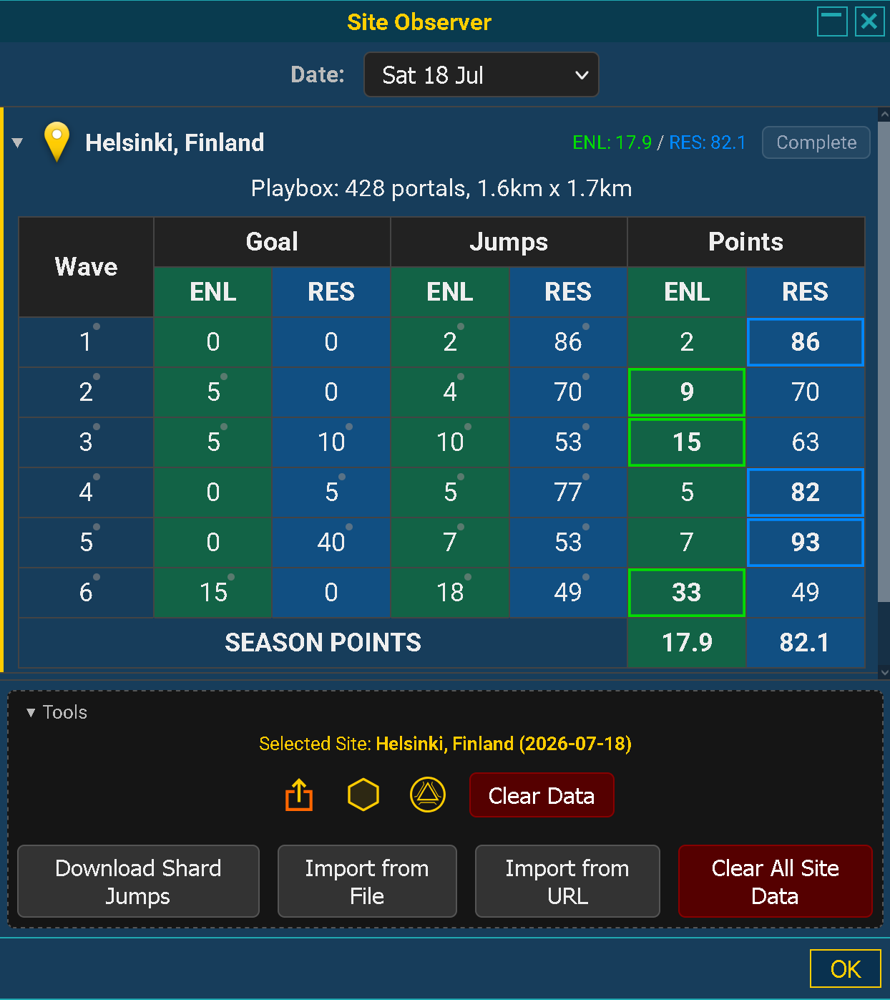

  

# IITC Plugin - Site Observer

Observes and records site data for Ingress Events. This currently covers:

- Pre-event ornaments
- Shards and target portals via the Shard Jump Times file (**CORE required**).

The data can be exported for general use, but primarily with the [Ingress Shards Map](https://ingress-shards.github.io/) project.

## Installation

| Release | Install Link | Details |
| :--- | :--- | :--- |
| **Production** | [iitc_plugin_site_observer.user.js](https://ingress-shards.github.io/iitc-plugin-site-observer/iitc_plugin_site_observer.user.js) | Current & upcoming events (+ last 3 months) |
| **Development** | [iitc_plugin_site_observer.dev.user.js](https://ingress-shards.github.io/iitc-plugin-site-observer/iitc_plugin_site_observer.dev.user.js) | Includes full historical event archives |

Either copy the link directly into IITC / IITC Button / Tampermonkey etc., or download the plugin and load it in from the filesystem.

## Data availability & Privacy

Due to the real-time nature of Ingress events, this plugin relies on data availability to provide accurate information. Network instability, timings or Niantic server instability may result in inaccurate information. Some data may be available for the site via the [Shard Map data folder](https://github.com/ingress-shards/ingress-shards.github.io/tree/main/data).

All observed data is stored locally on your device in your browser's IndexedDB (`iitc_site-observer`). No data is sent to external tracking servers.

## Usage

  

Select the site observer button (Desktop) or menu item (mobile) to display the site observer panel. The desktop button includes a pulsing signal dot that illuminates whenever new data is observed and recorded.

Selecting a date will show all sites for that day, its current status, a pin icon to go straight to that location and to expand the site to show further details.

Clicking on the pin will centre the map on the location of the site and zoom in to load all portals in that area.

Ornamented portals will be observed up to 2 hours before the event starts. At this point the site observer will display **playbox** information: the number of ornamented portals and the dimensions of the playbox. You may need to move the map around to view all of the ornamented portals.

The site observer is aware of each action that will occur during the event (shard spawn / jump, target portal appear etc.), and will automatically observe one minute after the action. This will involve downloading the shard jump times, processing them and displaying the current scores.

Expanding a site row reveals the wave-by-wave scoring breakdown, including current scores (ENL / RES), wave action timings, and secured targets.

The next update will be displayed at the bottom of the panel where applicable.

The Tools menu at the bottom allows for the data for a selected site to be exported (Site Record, Pre-Event Ornaments, or Target Portals), or cleared. The shard jump times can also be manually downloaded, or data imported via file or URL, alongside clearing all site data.

## Future development

The following features are not yet implemented, but are planned for the future:

- Tracking battle beacons during events
- Tracking shards via the Intel page (without **CORE**).

## Acknowledgements

Created using the [IITC Plugin Kit](https://github.com/McBen/IITCPluginKit)
Thanks to the [IITC app community](https://iitc.app) for guidance and feedback during development.
